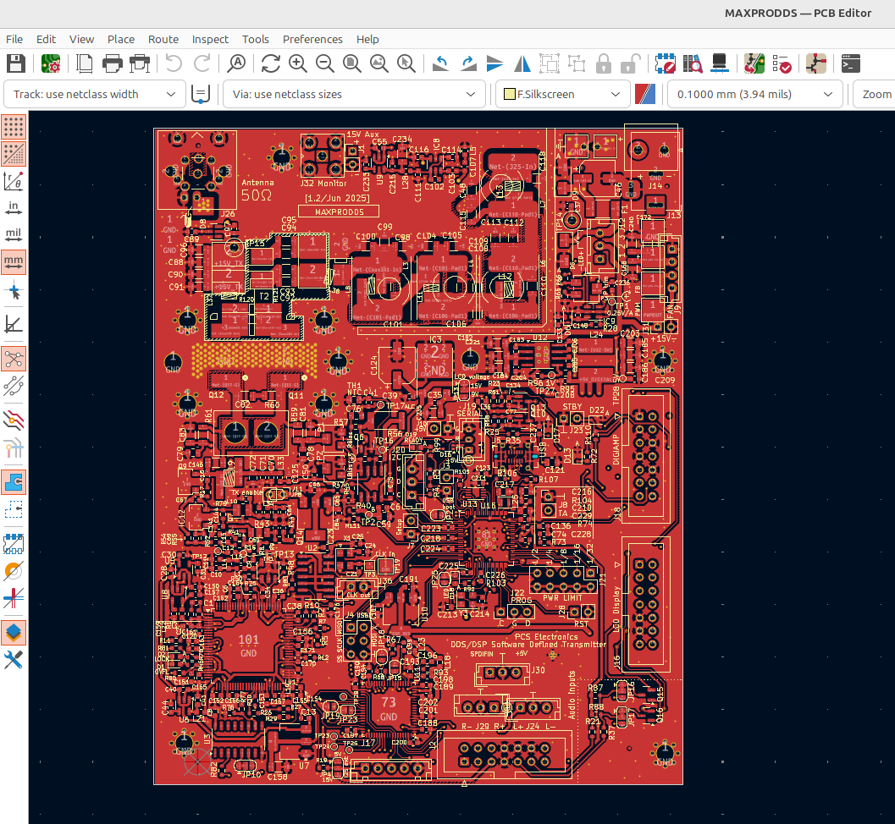
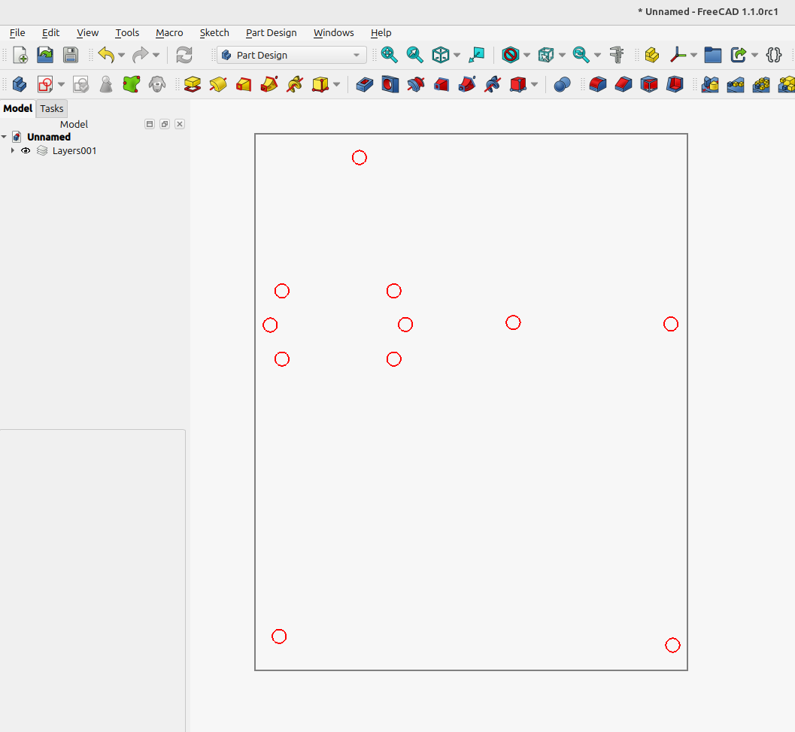

# Gerber to DXF Converter

`gerber-to-dxf.py` extracts board outline geometry and mounting holes from Gerber/Excellon manufacturing files in the current folder, then writes them to a DXF file.

The script automatically:
- Detects the board outline Gerber (`*-Edge_Cuts.gbr`, or a profile Gerber fallback).
- Detects drill files (`*-PTH.drl` and `*-NPTH.drl` when available).
- Converts the board outline (lines/arcs) to DXF layer `OUTLINE`.
- Converts drill hits within a selected diameter range to circles on DXF layer `MOUNTING_HOLES`.
- Writes output as `<project>-outline-mounting-holes.dxf`.

## Command-Line Options

- `--min <mm>`: Optional minimum hole diameter in millimeters.
  - Default: `3.0`
  - Example: `--min 2.5`
- `--max <mm>`: Optional maximum hole diameter in millimeters.
  - Default: no maximum
  - Example: `--max 4.0`

## Usage

Run commands from the folder that contains your Gerber and drill files.

### Windows

```powershell
cd "C:\path\to\your\Gerbers"
python gerber-to-dxf.py
python gerber-to-dxf.py --min 2.5
python gerber-to-dxf.py --min 2.5 --max 4.0
```

### macOS

```bash
cd "/path/to/your/Gerbers"
python3 gerber-to-dxf.py
python3 gerber-to-dxf.py --min 2.5
python3 gerber-to-dxf.py --min 2.5 --max 4.0
```

### Linux

```bash
cd "/path/to/your/Gerbers"
python3 gerber-to-dxf.py
python3 gerber-to-dxf.py --min 2.5
python3 gerber-to-dxf.py --min 2.5 --max 4.0
```

## Output Summary

After running, the script prints:
- Output filename
- Number of outline entities
- Number of holes that met the selected diameter filter
- Hole diameters used

## Compatibility

Tested with KiCad 9.0 generated Gerber/Excellon files.

Note: All the work in this repository update was AI generated.

## Images




